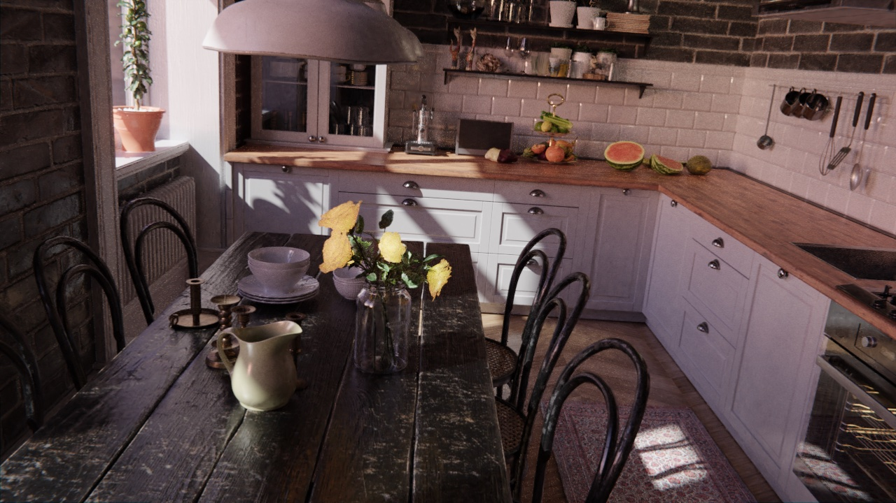
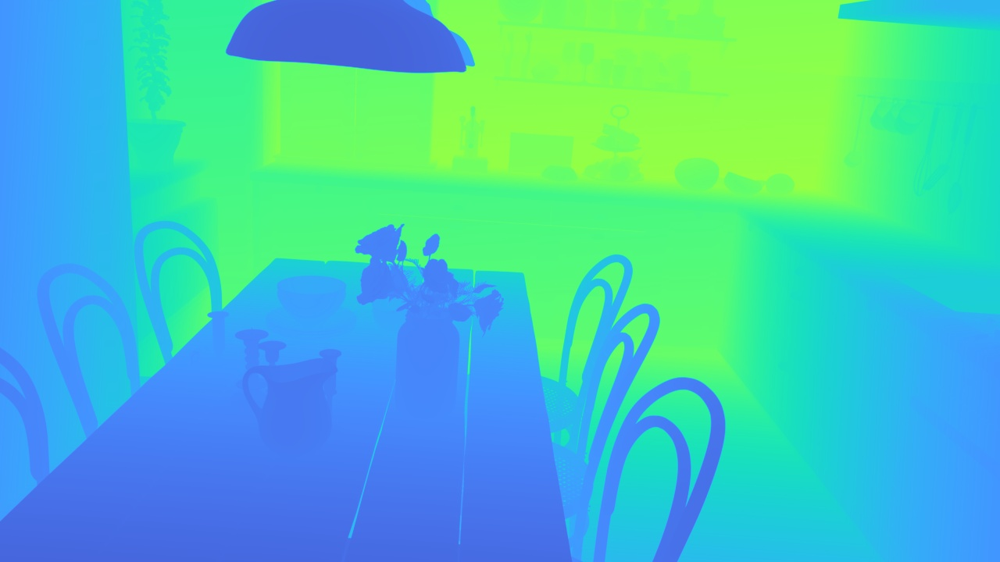
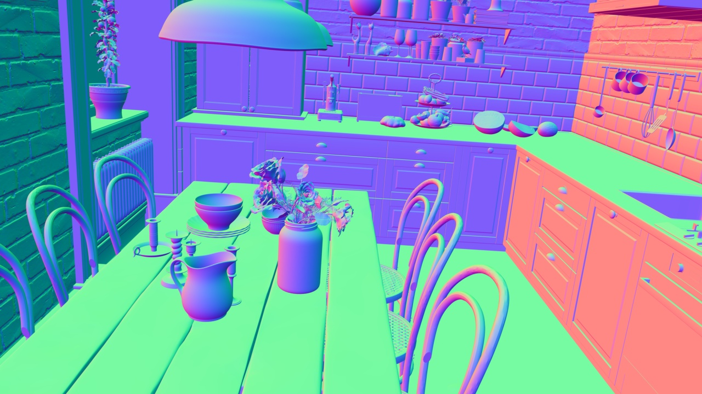
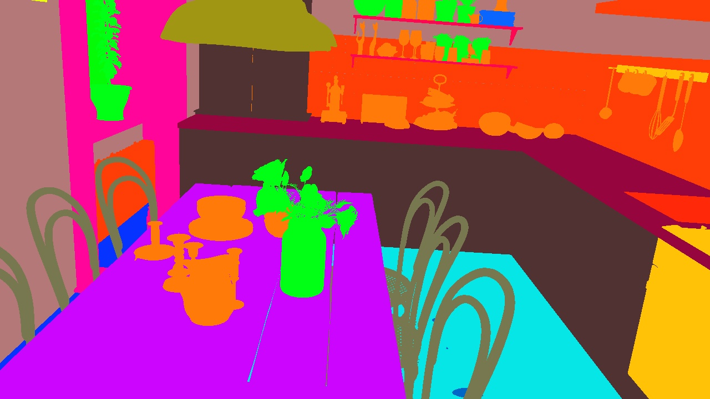
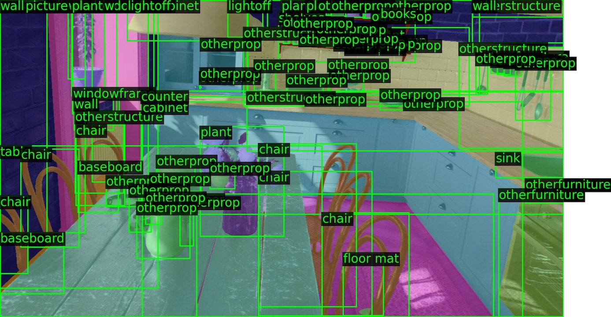
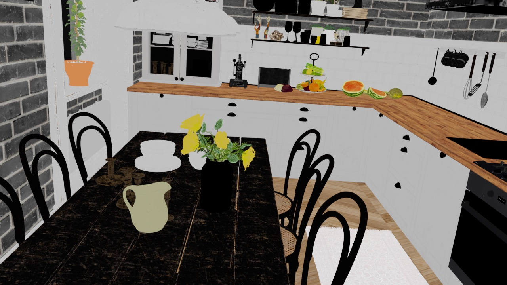
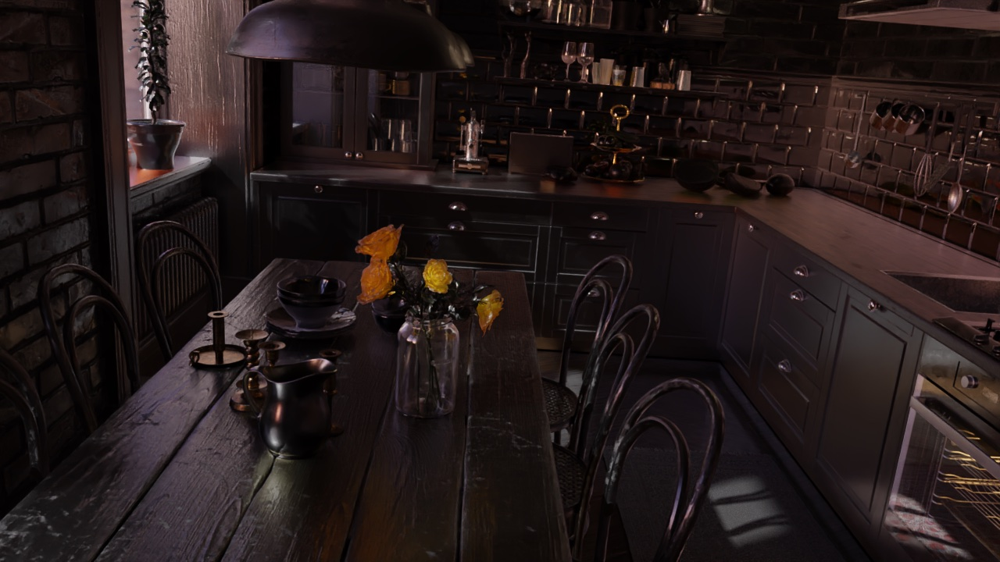

Data
====

The ``geosynth`` command-line tool offers a convenient way of
downloading the geosynth dataset.

**Attention!** Currently only the `demo` variant is available, the full dataset and additional datatypes will be released in the near future.

To download all non-hdr dataset, run:

.. code-block:: bash

    geosynth download non-hdr --variant=full

If you also wish to include HDR data, specify ``all``, instead.
The HDR data more than doubles the size of the download, so only download it if you need it.
It is recommended to only specify the data types you need.

To download just a few scenes of the dataset, download the ``demo`` variant.
The ``demo`` variant is the default ``--variant`` option:

.. code-block:: bash

    geosynth download non-hdr --variant=demo

By default, the contents will be downloaded to ``~/data/geosynth/``.
To specify an alternative download location, specify the ``--dst`` argument.

See all download options by running ``geosynth download --help``:

.. code-block:: bash

    $ geosynth download --help

    Usage: geosynth download [OPTIONS] DTYPES...

     Download the GeoSynth data.

    ╭─ Arguments ──────────────────────────────────────────────────────────────────────────╮
    │ *    dtypes      DTYPES...  Assets to download. Either specify "non-hdr", "all", or  │
    │                             a subset of: [cube_environment_map, depth, extrinsics,   │
    │                             gravity, hdr_cube_environment_map, hdr_reflectance,      │
    │                             hdr_residual, hdr_rgb, hdr_shading,                      │
    │                             hdr_sphere_environment_map, instance_segmentation,       │
    │                             intrinsics, layout_lines_full, layout_lines_occluded,    │
    │                             layout_lines_visible, lighting, normals, reflectance,    │
    │                             residual, rgb, semantic_segmentation, shading,           │
    │                             sphere_environment_map]).                                │
    │                             [required]                                               │
    ╰──────────────────────────────────────────────────────────────────────────────────────╯
    ╭─ Options ────────────────────────────────────────────────────────────────────────────╮
    │ --dst                        PATH         GeoSynth download directory.               │
    │                                           [default: ~/data/geosynth]                 │
    │ --variant                    [demo|full]  Variant of dataset to download.            │
    │                                           [default: demo]                            │
    │ --force      --no-force                   Force a re-download, despite locally       │
    │                                           cached files.                              │
    │                                           [default: no-force]                        │
    │ --cleanup    --no-cleanup                 Delete zip files after unzipping.          │
    │                                           [default: cleanup]                         │
    │ --help                                    Show this message and exit.                │
    ╰──────────────────────────────────────────────────────────────────────────────────────╯

Once downloaded, it's recommend to access data in the following manner:

.. code-block:: python

    from geosynth import GeoSynth

    geosynth = GeoSynth("PATH_TO_DATA")  # or leave empty for default "~/data/geosynth/".

    print(f"GeoSynth has {len(geosynth)} scenes.")

    scene = geosynth[100]  # Data can be accessed via indexing like a list.

    # or iterated over in a for loop:
    for scene in dataset:
        # Each Scene object contains attributres for each datatype.
        # Contents can be read from disk via the ``read`` method.
        rgb = scene.rgb.read()  # (H, W, 3) np.ndarray
        depth = scene.depth.read()  # (H, W) np.ndarray
        intrinsics = scene.intrinsics.read()  # (3, 3) camera intrinsics
        instances = scene.instance_segmentation.read()  # dictionary of instance masks.

        # many datatypes have a ``visualize`` method
        depth_viz = scene.depth.visualize(depth)  # Returns a (H,W,3) turbo-colorized image.
        instances_viz = scene.instance_segmentation.visualize(instances, rgb=rgb)

In python snippets below, the ``scene`` variable in this example will be referenced.

When data involves a coordinate system, GeoSynth abides by the following right-hand convention:

+-------+-----------+
| Label | Direction |
+=======+===========+
| +X    | Right     |
+-------+-----------+
| +Y    | Down      |
+-------+-----------+
| +Z    | Forward   |
+-------+-----------+

Images in subsequent sections represent visualizations and may not be a direct
representation of the data itself.

rgb
^^^

Image of the scene in RGB-channel order.
Data is a ``uint8`` numpy array of shape ``(720, 1280, 3)``.

hdr_rgb
^^^^^^^
High dynamic range version of `rgb`_.

depth
^^^^^

Depthmap of the scene in meters.
Data is a ``float32`` numpy array of shape ``(720, 1280)``.

normals
^^^^^^^

Surface normals of the scene.
Data is a ``float32`` numpy array of shape ``(720, 1280, 3)``.
Each pixel represents a unit-norm ``(x, y, z)`` vector pointing away from the camera.

intrinsics
^^^^^^^^^^
Standard ``(3, 3)`` camera intrinsics.

.. code-block:: python

   array(
       [
           [1.0319166e03, 0.0000000e00, 6.4000000e02],
           [0.0000000e00, 1.0319166e03, 3.6000000e02],
           [0.0000000e00, 0.0000000e00, 1.0000000e00],
       ],
       dtype=float32,
   )

gravity
^^^^^^^
A unit-norm ``float32`` numpy array of shape ``(3)``.
Points in the direction of gravity, and will typically agree with floor surface normals.
Usually, gravity will be mostly ``+Y`` component.

.. code-block:: python

   array([-0.07105822, 0.9611216, 0.26682544], dtype=float32)

semantic_segmentation
^^^^^^^^^^^^^^^^^^^^^
GeoSynth semantic classes are an extension of NYU40 labels.
A tuple of these strings exists at ``scene.semantic_segmentation.CLASSES``.
For clarity, the classes and their indices are reproduced here:

+-------+-----------+-------+----------------+-------+----------------+
| Index | Label     | Index | Label          | Index | Label          |
+=======+===========+=======+================+=======+================+
| 0     | unknown   | 16    | curtain        | 32    | night stand    |
+-------+-----------+-------+----------------+-------+----------------+
| 1     | wall      | 17    | dresser        | 33    | toilet         |
+-------+-----------+-------+----------------+-------+----------------+
| 2     | floor     | 18    | pillow         | 34    | sink           |
+-------+-----------+-------+----------------+-------+----------------+
| 3     | cabinet   | 19    | mirror         | 35    | lamp           |
+-------+-----------+-------+----------------+-------+----------------+
| 4     | bed       | 20    | floor mat      | 36    | bathtub        |
+-------+-----------+-------+----------------+-------+----------------+
| 5     | chair     | 21    | clothes        | 37    | bag            |
+-------+-----------+-------+----------------+-------+----------------+
| 6     | sofa      | 22    | ceiling        | 38    | otherstructure |
+-------+-----------+-------+----------------+-------+----------------+
| 7     | table     | 23    | books          | 39    | otherfurniture |
+-------+-----------+-------+----------------+-------+----------------+
| 8     | door      | 24    | refrigerator   | 40    | otherprop      |
+-------+-----------+-------+----------------+-------+----------------+
| 9     | window    | 25    | television     | 41    | plant          |
+-------+-----------+-------+----------------+-------+----------------+
| 10    | bookshelf | 26    | paper          | 42    | doorframe      |
+-------+-----------+-------+----------------+-------+----------------+
| 11    | picture   | 27    | towel          | 43    | windowframe    |
+-------+-----------+-------+----------------+-------+----------------+
| 12    | counter   | 28    | shower curtain | 44    | baseboard      |
+-------+-----------+-------+----------------+-------+----------------+
| 13    | blinds    | 29    | box            | 45    | lighton        |
+-------+-----------+-------+----------------+-------+----------------+
| 14    | desk      | 30    | whiteboard     | 46    | lightoff       |
+-------+-----------+-------+----------------+-------+----------------+
| 15    | shelves   | 31    | person         | 47    | curtainrod     |
+-------+-----------+-------+----------------+-------+----------------+

instance_segmentation
^^^^^^^^^^^^^^^^^^^^^
Instance segmentation masks with same labels as `semantic_segmentation`_.
Data is represented as a dictionary, mapping the string labels (like ``"chair"``)
to ``(N, H, W)`` boolean numpy masks, where ``N`` is the number of those instances in the scene.
If bounding boxes are needed, see functions ``geosynth.instance_bbox`` and ``geosynth.instance_segmentation_bboxes``.

shading
^^^^^^^
Intrinsic image decomposition component that represents elements coming from **direct** lighting.

reflectance
^^^^^^^^^^^
Intrinsic image decomposition component that represents the intrinsic color of the surface (i.e. albedo).

residual
^^^^^^^^
Intrinsic image decomposition component that represents elements coming from **indirect** lighting.

hdr_shading
^^^^^^^^^^^
High dynamic range version of `shading`_.

hdr_reflectance
^^^^^^^^^^^^^^^
High dynamic range version of `reflectance`_.

hdr_residual
^^^^^^^^^^^^
High dynamic range version of `residual`_.
